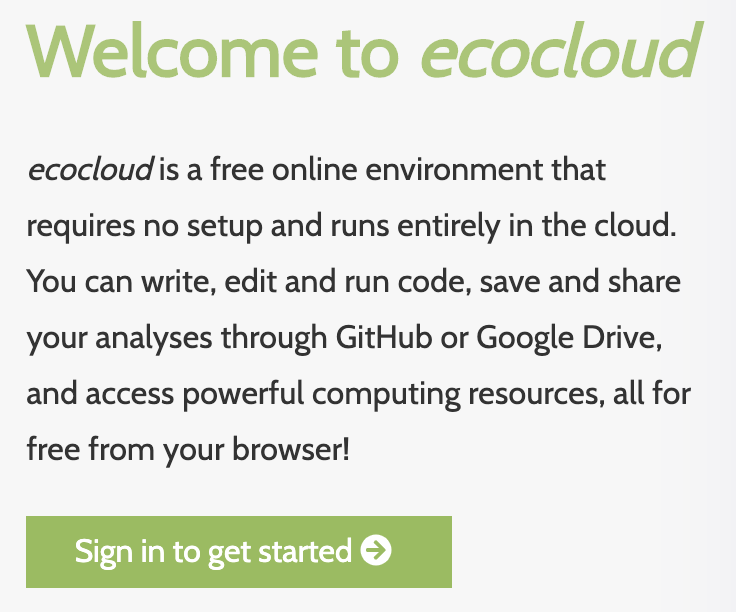
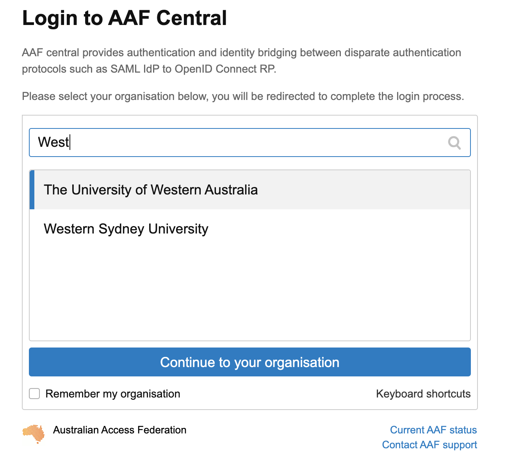
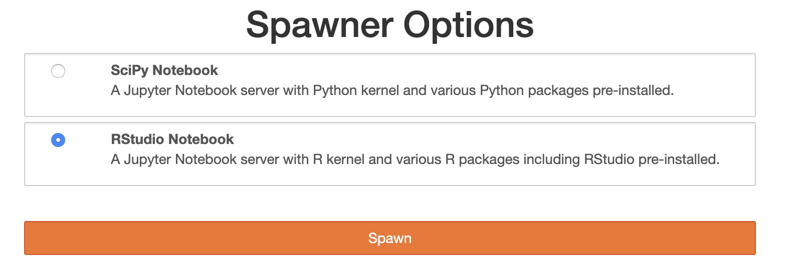
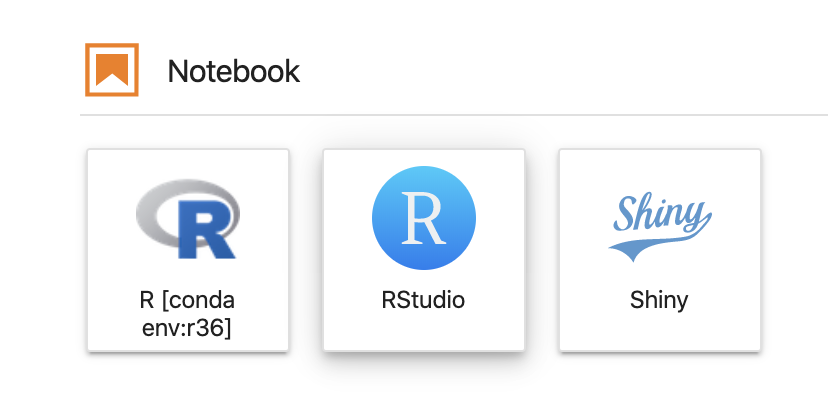
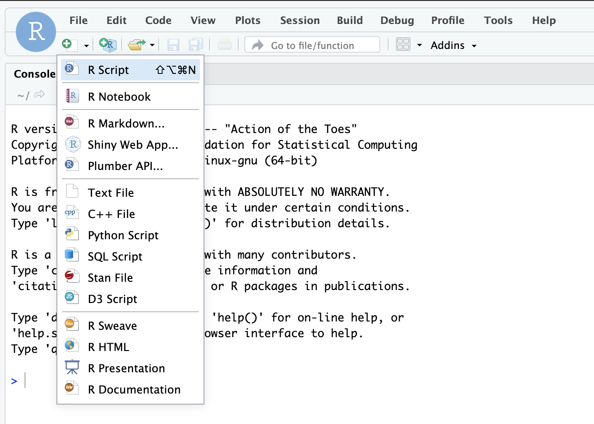
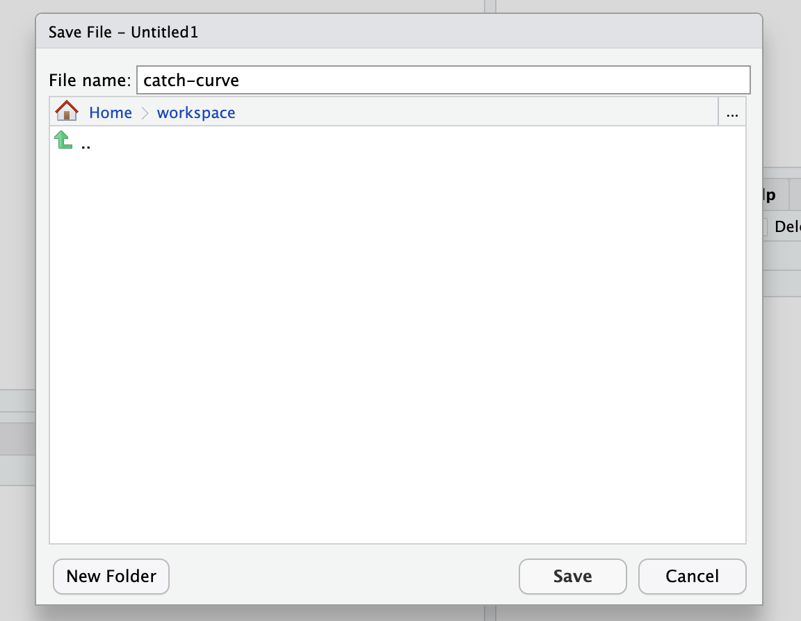

How-to-use-ecoloud
================
TimLanglois
13/01/2020

To run R we are going to use an RStudio server through a new service
called ecocloud.

Each of you will have your own server and your own permanent workspace
on ecocloud (10gb).

This service will be linked to your UWA ID.

We strongly recommend you use Chrome as your browser. Safari should also
work but has not been tested.

Go to [app.ecocloud.org.au](https://app.ecocloud.org.au/)

 

 

## Logging into ecocloud

Log in using AAF (which will use your University credentials)

You may be redirected to a Attribute release approval page. Just select
“Ask me again if information to be provided to this service changes”
and click Accept

 

 

## Starting a Server

Once logged in you will be on the Dashboard

Go to Tools page

Click ‘R (RStudio and Jupyter)’ and follow the prompts to start an R
Server.

Make sure to choose RStudio notebook in the Spawner options.

 

 

This will set you up on a virtual RStudio server in the cloud.

Be patient whilst this happens. This maybe a bit slow.

## Start RStudio and set working directory

Once your Server has started you will be on the JupyterLab dashboard.

Within the Notebook options - Click on the RStudio box. This will open
an RStudio session in a new tab.

 

 

The workspace folder is permanent, and will not be deleted even when you
shutdown your server. You can also access this folder and it’s contents
from the ecocloud website.

Your RStudio server should look like this     

## Create an R script

Click on the Green + at top left.  

  

Create an R script.

Save this script in your Working directory using a descriptive name e.g.
“Catch curve.r”

 

 

Well done.

If you haven’t used R before you will find plenty of help on forums on
the internet.

We recommend you create a seperate R script for every practial.

## End RStudio

**IMPORTANT**

Once you have finished using RStudio on ecocloud for the day, please
**Termiate** your session using the **Red** power button at the top
right of the RStudio window.

Before you do this - remember to save your .R script in your workspace
folder and it will be ready waiting for you next time you start
ecocloud.

Go back to
[instructions](https://github.com/UWA-SCIE2204-Marine-Systems/1-instructions/blob/master/README.md)

## Additional background on R

Here are some extra
resources:

[Introduction-to-R-and-RStudio](https://github.com/UWA-SBS-Intro-to-R-RStudio-Tidyverse/Introduction-to-R-and-RStudio/blob/master/Introduction-to-R-and-RStudio.md)

[Introduction-to-tidyverse-and-pipes](https://github.com/UWA-SBS-Intro-to-R-RStudio-Tidyverse/Introduction-to-tidyverse-and-pipes/blob/master/Using-tidyverse-and-pipes.md)

[more dplyr and
tidyr](https://jules32.github.io/2016-07-12-Oxford/dplyr_tidyr/)

[Jenny Bryan’s excellent R course](https://stat545.com/)
