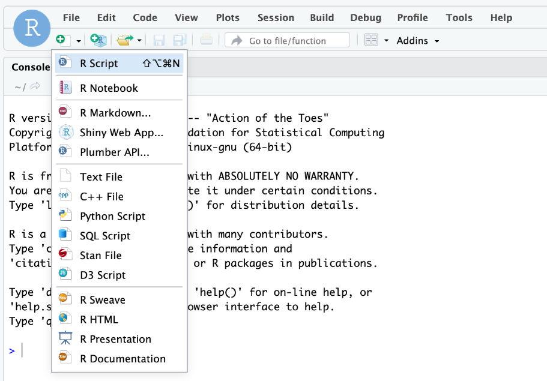

```{r setup, include=FALSE}
knitr::opts_chunk$set(echo = TRUE)
```

## GitHub Documents

We are running the computer labs for SCIE2204 using R and R studio. 

R is a free and widely used statistical program. RStudio is a graphical user interface (GUI) to make R more user friendly. 

This guide tells you how to install R and RStudio on your computer at home/local computer. 

You will need to do this to run the labs - unless you are using the ecocloud RStudio cloud computing service.


### Step 1 install R

- Go to <https://cran.csiro.au/> and click on "Download R for (Mac) OS X" OR "Download R for Windows" depending on your machine.
- Windows people: Click "base" and then click "Download R 3.6.3 for Windows
- Mac people: Click on the .pkg file that correspondeds to your operating system (3.6.3 fir OS X 10.11 (El Capitan) and higher; 3.3.3 for OS X 10.9 (Mavericks) and higher
- Once the .exe file has downloaded open it and follow the instructions to install R. Accept the defaults. 

### Step 2 install R studio

- Go to <https://rstudio.com/> and click Downlod (Its at the top)
- Click Download under the free version column
- Select the Download option corresponding to your operating system - e.g. "RStudio-1.2.5033.exe" for Windows 10/8/7
- Once the .exe file has downloaded open it and follow the instructions to install R studio. Accept the defaults. 

### Step 3 Open R studio and start an R script

To open R studio click on the R studio app icon (blue circle with white R) and you should be looking at R studio which will be talking to R (you don't need to open R directly).

To create an R script click on the Green + at top left.
</br>

{ width=25% }

</br>


Save this script somewhere you wont lose it and with a descriptive name e.g. "Catch curve.r"

If you haven't used R before you will find plenty of help on forums on the internet.

We recommend you create a seperate R script for every practial.


### Step 4 You should be good to go

Well done!!

Now you can start to follow the instructions for the first lab at <https://github.com/UWA-SCIE2204-Marine-Systems/Catch-curve/blob/master/CatchCurveMarkdown.md> 


For additional help and background on using R here are some additional resources:

[Introduction-to-R-and-RStudio](https://github.com/UWA-SBS-Intro-to-R-RStudio-Tidyverse/Introduction-to-R-and-RStudio/blob/master/Introduction-to-R-and-RStudio.md)

[Introduction-to-tidyverse-and-pipes](https://github.com/UWA-SBS-Intro-to-R-RStudio-Tidyverse/Introduction-to-tidyverse-and-pipes/blob/master/Using-tidyverse-and-pipes.md)

[more dplyr and tidyr](https://jules32.github.io/2016-07-12-Oxford/dplyr_tidyr/)

[Jenny Bryan's excellent R course](https://stat545.com/)


